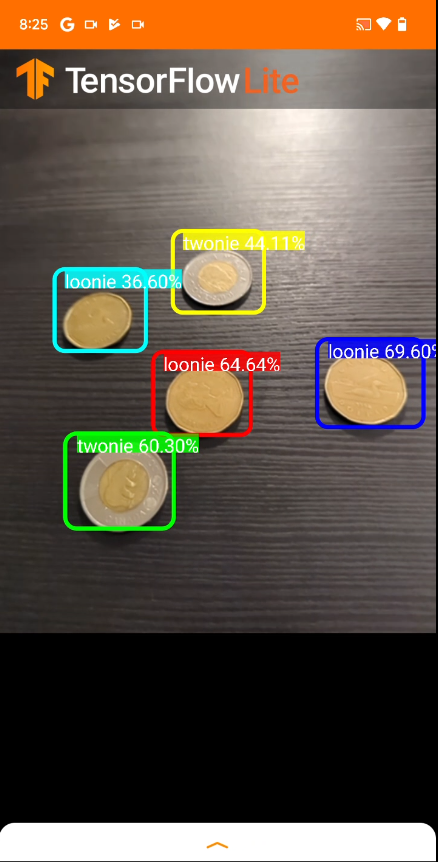

# machineLearningStarter

This repository is meant to provide a series of scripts and instructions on how to get started with Tensorflow tflite models on the Android. The end product of these scripts is in the image below:

You will be able to detect coins.

Reproducability and getting started quick is important for the general reader. I have made sure to include instructions and scripts that have been tested on an AWS AMI that you can use yourself right away without wasting time adjusting scripts to fit your machine. It assumed reader is familiar with Bash, SSHing, basic Python, basic AWS for creating EC2 instance and basic Android Studio. To train the Tensorflow 1 model on c4.4xlarge Ubuntu EC2 instance takes one hour and forty four minutes. The Tensorflow 2 model is slightly more time consuming.

The setup involved with Tensorflow and Android is not trivial. I found Tensorflow is finicky to install and use with the various commands used in `setup_tensorflow_env`. There are instances where I had to switch Tensorflow versions in between commands. In addition, at the time of writing, latest commit for Android app did not work with my tflite models which is why I used a previously forked version which I share with you in `run_tensorflow`.

The models produced aren't production quality but they are good enough. If you want to improve the generated models for your specific applications then you can modify the config files in `setup_tensorflow_env/tensorflow_1/pipeline.config` and `setup_tensorflow_2/pipeline.config`. Modifying the config files is a whole 'nother can of worms out of scope here.

We are detecting coins from Canada (loonie/twonie). If you are not from Canada...I am sorry! Maybe you can modify the code to accommodate your local coins or see if the model can still detect some of your coins.

## What to run

In order run

 - `generate_tf_records`
 - `setup_tensorflow_env`
 - `run_tensorflow`

Each folder has its own detailed README.
