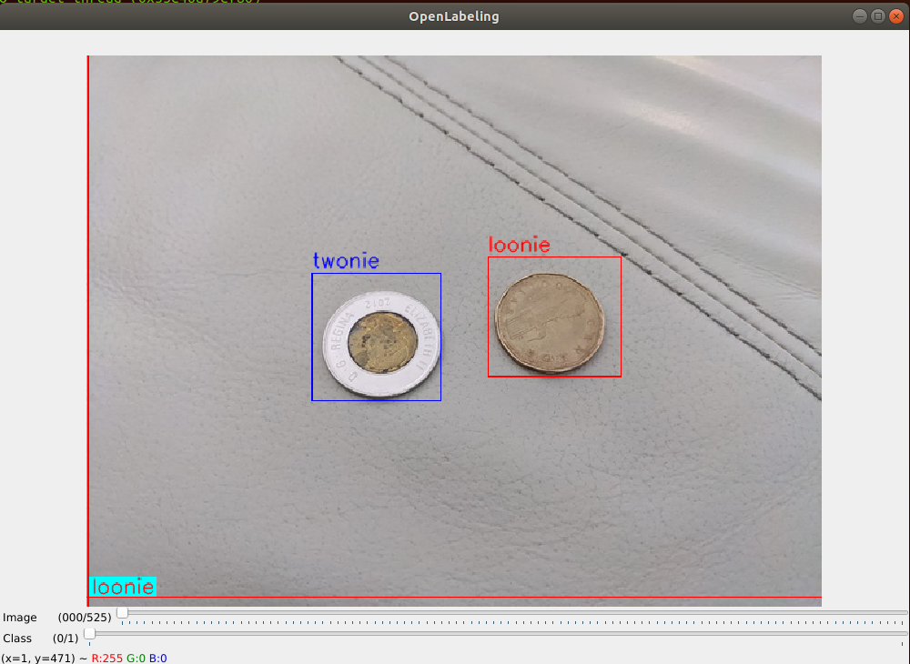

# Creating *.tfrecords

Here we will discuss how to create tfrecords which are files needed to train Tensorflow models.

## Compressing pictures

Place your desired images in the `images` folder which is located in the root of this repository and Run `compress.py`. I left a few sample images in `images` folder but not all as there 526 original images for a total of 2.1 Gb. Too much for Github.

In my case, all pictures were taken with a Google Pixel 4 which produces images of size `(4032, 3024)` or `(3024, 4032)` depending on rotation.

In commit 1ff6d7aa9bdf9749ada28bf67ad435ca518b6232, the preview size is [(640,480)](https://github.com/tensorflow/examples/blob/1ff6d7aa9bdf9749ada28bf67ad435ca518b6232/lite/examples/object_detection/android/app/src/main/java/org/tensorflow/lite/examples/detection/DetectorActivity.java#L61) which is 6.3 multiple of `(4032,3024)`. The [(640,480)] images are fed into the Android's tflite so I thought it would be appropriate to test on [(640,480)] sized images (plus you get to see them as they take up less space).


 We rotate all images to `(4032,3024)` and compress them to preview size. I left all the compressed images for your viewing as they take up 65.1 Mb of space.

To compress images we run

```
python compress.py
```

The compressed images will be in `machineLearningStarter/generate_tf_records/compressed`.

## Tagging Pictures

We are using the [OpenLabeling](https://github.com/Cartucho/OpenLabeling) application. Place the compressed images from `machineLearningStarter/generate_tf_records/compressed` to `OpenLabeling/main/input` and modify `OpenLabeling/main/class_list.txt` to contain lists of objects. In our case it will just be

```
loonie
twonie
```



Then run

```
cd OpenLabeling/main`
python main.py
```

to tag the images. Copy the results from `OpenLabeling/main/output/PASCAL_VOC/*.xml` to `machineLearningStarter/generate_tf_records/tagging`.

## Create the tfrecords

Run 

```
mkdir -p tf_records
mkdir -p tf_records_training
python generate.py
```

First you would need to install tensorflow 2 locally.

```
conda env create -n tensorflow_generate
conda create --name tensorflow_generate python=3.6
conda activate tensorflow_generate
pip install tensorflow==2.6.0
pip install Pillow
pip install tensorflow-object-detection-api
```

If you want to modify the code for your classes then you will have to modify `generate.py`. In particular:

```python
class_count = 2 #twonie/loonie
```

and

```python
        if coord['name'] == 'twonie':
             classes.append(1)
        else:
             classes.append(2)
```
